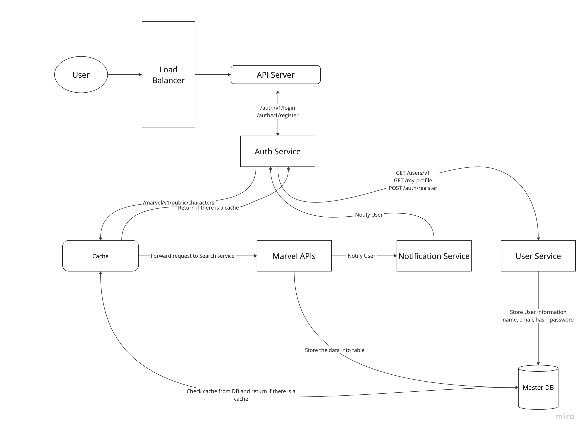
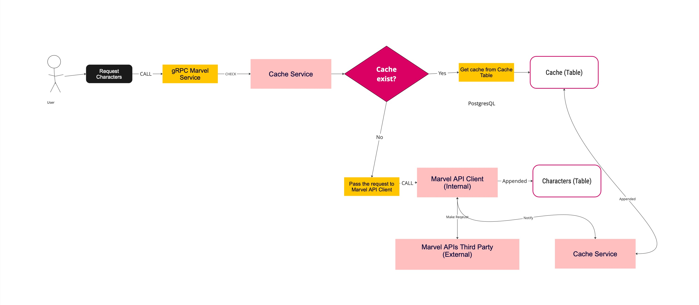

# Marvel API
Main focus of this APIs is to fetch data from Marvel API, where this API should be low-latency, high-performance and reliability.

## A. Functional Requirements
1. Implement a gRPC service to act as a proxy for the Marvel API:
    - Accept parameters like query, offset, and limit.
    - Internally call the Marvel API (GET /v1/public/characters).
    - Convert the REST API response to a gRPC-compatible format and return it.
2. Integrate a caching mechanism to improve response times:
   - Store and retrieve character data locally.
   - Check the cache first for requested data.
   - If cache is invalid or missing:
      * Fetch fresh data from the Marvel API.
      * Update the cache and return the data.
   - Implement cache expiration/invalidation policies for outdated data.
3. Add metrics or logging for:
   - Cache hit rates (requests served from cache).
   - Cache miss rates (requests requiring an API call).
4. Should detect any changes Use polling or webhook simulation to detect changes.
5. Continuously listen for updates and process them asynchronously to avoid blocking incoming client requests.
6. Should update the cache when New characters are added, Existing characters are updated. 
7. Should Notify clients in real time when New characters are added, Existing characters are updated.
8. Notifications must be delivered using gRPC streaming or WebSocket.
10. Ensure consistency in the cache despite partial failures. 
11. High-volume API requests.
12. Concurrent updates and notifications.

---

## B. Non-functional Requirements
1. **Security:** Manage API keys securely (avoid hardcoding secrets), and using Authentication
2. **Performance:** 
   - Ensure low latency and high cache efficiency, 
   - Database indexing by create table specialize for read, this solution Optimized for reading, main table won't be impacted by indexing. However, might need more larger storage
   - Use rate-limiting to prevent abuse and ensure fair resource allocation.
3. **Maintainability:** 
   - Provide clear logs, metrics, and modular design.
   - Write code by following coding practice to ensure readability, and maintanability.
   - Adopt a modular design to ensure code reusability and ease of future enhancements.
4. **Testability:** Ensure comprehensive test coverage.
5. **Compatibility:** Enable seamless execution from an IDE.
6. **Reliability and Fault Tolerance:**
    - Implement retry logic with exponential backoff when an API call fails, ensuring that transient failures are handled gracefully without overwhelming the system. This mechanism will help maintain the reliability of the system in the face of temporary network issues or service unavailability.
    - Using polling to make request every 24 hours to make sure our data are up-to-date with Marvel APIs

---

## C. API Layer
### gRPC Service Design for Marvel API
### POST
| Endpoint Name	    | Input                  |
|-------------------|------------------------|
| /v1/auth/register | 	name, email, password |
| /v1/auth/login | email, password |

### GET
| Endpoint Name	| Params                                                         |
|---------------|----------------------------------------------------------------|
| /v1/users/my-profile | JWT Auth token                                                 |
| /v1/characters/params	| query (search term, e.g., /v1/characters/params?name=Iron Man) |
| /v1/characters/	| name, nameStartsWith, modifiedSince, limit, offset             |

---

## D. Database Layer
| User Table    |                            |
|---------------|----------------------------|
| **id**        | `UUID PRIMARY KEY NOT NULL` |
| **name**      | `VARCHAR`                  |
| **email**     | `VARCHAR NOT NULL UNIQUE`  |
| **password**  | `VARCHAR NOT NULL`         |
| **createdAt** | `Timestamp`                |
| **updatedAt** | `Timestamp`                  |
| **deletedAt** | `Timestamp`                  |

| Events Table       | Type                        | Description                                                                                                                  |
|--------------------|-----------------------------|------------------------------------------------------------------------------------------------------------------------------|
| **id**	            | `UUID PRIMARY KEY NOT NULL` |                                                                                                                              |
| **stream_id**      | 	`UUID`                     | Identifier for the event stream. Useful for grouping events related to the same entity or process.                           |
| **causation_id**	  | `UUID`	                     | Identifier for the event that caused this event (the causality relationship).                                                |
| **correlation_id** | `UUID`	                     | Identifier to correlate events from different streams (for example, tracking the same process across services).              |
| **type**	          | `VARCHAR`	                  | Type of the event, often used to define the event’s action (e.g., 'CharacterAdded', 'CharacterUpdated').                     |
| **created_at**	    | 	`Timestamp`                | when the event was created or logged.                                                                                        |
| **occurred_at**	   | `Timestamp`                 | when the event actually occurred (this could be different from created_at).                                                  |
| **data**	          | `JSONB = '{}'::jsonb`	      | The event payload stored as JSON. This holds the data of the event, such as the new character details or update information. |

|  Character Table   | Type                        | Description                                      |
|-------------------|-----------------------------|--------------------------------------------------------|
| **id**            | `UUID PRIMARY KEY NOT NULL` | Unique identifier for the character.                   |
| **name**          | `VARCHAR NOT NULL`          | Name of the character (e.g., "Spider-Man").            |
| **description**   | `TEXT`                      | Description of the character.                          |
| **image_url**     | `VARCHAR`                   | URL of the character’s image.                          |
| **created_at**    | `Timestamp`                 | Timestamp when the character was created.              |
| **updated_at**    | `Timestamp`                 | Timestamp when the character was last updated.         |

| Cache Table    | Type                        | Description                                |
|----------------|-----------------------------|--------------------------------------------|
| **id**         | `UUID PRIMARY KEY NOT NULL` | Unique identifier for the cache entry.     |
| **cacheKey**   | `VARCHAR`                   | Query with params Character name           |
| **characters** | `JSONB`                     | Cached character data in JSON format.      |
| **created_at** | `Timestamp`                 | Timestamp when the cache entry was created. |
| **updated_at** | `Timestamp`                 | Timestamp when the cache entry was last updated. |
| **expires_at** | `Timestamp`                 | Timestamp when the cache entry will expire. |

The **cache table** stores the character data in a `jsonb` format to be easily retrieved. The `expires_at` field is optional but could help in automatically invalidating stale cache entries after a certain time period.

| Notification Table   | Type                        | Description                                                        |
|-------------------|-----------------------------|--------------------------------------------------------------------|
| **id**            | `UUID PRIMARY KEY NOT NULL` | Unique identifier for the notification.                            |
| **type**          | `VARCHAR NOT NULL`          | Type of notification (e.g., "New Character", "Character Updated"). |
| **message**       | `TEXT NOT NULL`             | The message content of the notification.                           |
| **recipient_id**  | `UUID NOT NULL`             | ID of the user who should receive the notification.                |
| **created_at**    | `Timestamp`                 | Timestamp when the notification was created.                       |
| **sent_at**       | `Timestamp`                 | Timestamp when the notification was sent.                          |

---

## E. Deep Dive
For this system, there is 2 problem we can deep dive on.

### Estimate:
1. Daily Active User 100,000 users
2. Proximity Search 5 queries per user * 100,000 users = 500,000 queries/day
3. Read Per second 500,000 read per day / (24 hours * 3600 seconds) = 5,78 reads/seconds
---

### I. Caching
For caching, we have a few options here:

#### 1. Database Caching
We can simply store the data directly into a cache table every time we fetch, then set the expiration to handle overloaded data.
- **Pros:**
   - **No Additional Infrastructure Required:** Uses the existing database infrastructure.
   - **Persistent and Consistent:** Data is consistent with the database.
   - **Simple to Implement:** Easy to integrate into existing systems, for this placement test it will be beneficial, because take more short time to implement and can show strong assessment.

- **Cons:**
   - **Slower than In-Memory Caches:** Database I/O operations are slower than memory-based caches.
   - **Increases Database Load:** Frequent reads from the cache table may add load on the database.
   - **Limited Scalability:** Not as scalable as distributed or in-memory caches.
   - **Cost to scale**: scaling for extremely high reads can be costly and may require a number of database read-replicas

#### 2. In-memory Cache (e.g., Redis)
In-memory caching involves storing data in memory for faster access.
- **Pros:**
   - **Very Fast Access:** Extremely low latency for data retrieval.
   - **Reduced Load on Database:** Frequent reads are served directly from Redis.
   - **Scalable:** Redis supports clustering and partitioning for high availability.
   - **Advanced Features:** Supports persistence, pub/sub, and other advanced features.

- **Cons:**
   - **Volatile Data:** Data may be lost if the server crashes unless persistence is enabled.
   - **Requires Additional Infrastructure:** Needs setting up and maintaining a separate service.
   - **Memory Limits:** Can be expensive to scale as memory usage grows.

#### 3. Distributed Cache
Distributed caching involves sharing cache data across multiple nodes to improve scalability and fault tolerance.
- **Pros:**
   - **Highly Scalable:** Supports horizontal scaling to handle large data loads.
   - **Fault Tolerant:** Built-in replication ensures data availability even if a node fails.
   - **Load Balancing:** Load is evenly distributed across nodes, improving performance.

- **Cons:**
   - **Increased Complexity:** Requires more setup and maintenance compared to single-node caches.
   - **Network Latency:** Communication between nodes introduces slight overhead.
   - **Data Synchronization:** Ensuring consistency across distributed nodes can be challenging.

---
### Resources:
- [in-memory vs distributed caching](https://medium.com/@baraklagziel/in-memory-vs-distributed-caching-a-comparative-look-with-caffeine-15cedf6038c6)
- [Database caching](https://aws.amazon.com/caching/database-caching/)

### **Decision:**
I choose to use Database caching because more simple and straight forward, also can keep data for long-live.

### II. Notification
Actually, for notification, we have few options here:
#### 1. gRPC streaming
gRPC streaming allows real-time bidirectional communication between the client and server. The server pushes notifications to the client as soon as an event occurs, making it suitable for low-latency, real-time notifications.
- **Pros:** Real-time updates and Low latency, efficient for large-scale applications.
- **Cons:** 
  - Requires persistent connections, which could be resource-intensive.
  - Not ideal for environments with unstable or intermittent connectivity.

#### 2. WebSocket
WebSocket provides a full-duplex communication channel that allows servers to send real-time notifications to the client. It is often used for applications where real-time interaction is necessary (e.g., chat apps).
- **Pros:**
  - Real-time updates with low latency.
  - Persistent connection reduces the need for repeated requests.
- **Cons:** Requires managing WebSocket connections at scale, more complex to implement compared to traditional HTTP-based solutions.

#### 3. Polling
Polling involves the client regularly requesting updates from the server at specified intervals to check for new notifications. This method can be simple to implement and doesn't require long-lived connections like WebSocket or gRPC streaming.
- **Pros:** More easier to implement, Works well with existing REST APIs.
- **Cons:** Higher server load due to regular requests, Notifications have intervals time, Not as efficient as push-based solutions.

#### 4. Push notification using Kafka or RabbitMQ
Push notifications can be triggered by event changes in the system, such as when a new event occurs. Kafka or RabbitMQ can act as an event bus, delivering events to services that trigger notifications.
- **Pros:** 
   - Scalable, decouples notification service from the core application.
   - Reliable event delivery.
- **Cons:** Adds complexity to the system, Requires additional infrastructure like Kafka or RabbitMQ.

### **Decision:**
I’ll implement a **Notification Saga** to handle user notifications triggered by events, like adding or updating characters. The saga will listen for events and generate notifications accordingly. These notifications will be delivered to users via **polling**, where the system periodically checks for new notifications and sends them to users. This approach ensures consistency, fault tolerance, and scalability by decoupling the notification process from the rest of the system while using polling to manage the delivery load efficiently.

---

## F. High Level Design

<b>Image 1.0 High Level Design</b>

---

<b>Image 2.0 Request flow design</b>

### End-to-end flow summarized
1. **User sends a request (e.g., login, registration, or Marvel character search)** → The Load Balancer routes the request to the API Server.
2. **API Server routes the request based on the endpoint**:
    - **Authentication requests** (`/auth/v1/login` or `/auth/v1/register`) → Forwarded to the Auth Service.
    - **Marvel character search requests** (`/marvel/v1/public/characters`) → First checks the Cache.
3. **Cache checks for data**:
    - **Cache Hit**: Return the cached response to the API Server.
    - **Cache Miss**: Forward the request to the Marvel Service for data retrieval.
4. **Auth Service processes authentication**:
    - **Login**: Validates user credentials and retrieves user details from the Master DB via the User Service.
    - **Registration**: Stores user information (name, email, hashed password) in the Master DB via the User Service.
5. **Marvel Service handles the data request**:
    - Makes a request to the Marvel API to fetch data.
    - Compares the fetched data with the cache or database to identify new or updated Marvel characters.
    - Stores new or updated data in the cache and database.
6. **Notification Service sends updates**:
    - If **new Marvel characters** are added or existing ones are updated, the Notification Service sends an update notification to the user.
7. **API Server sends the response** back to the user via the Load Balancer, ensuring a seamless experience.

